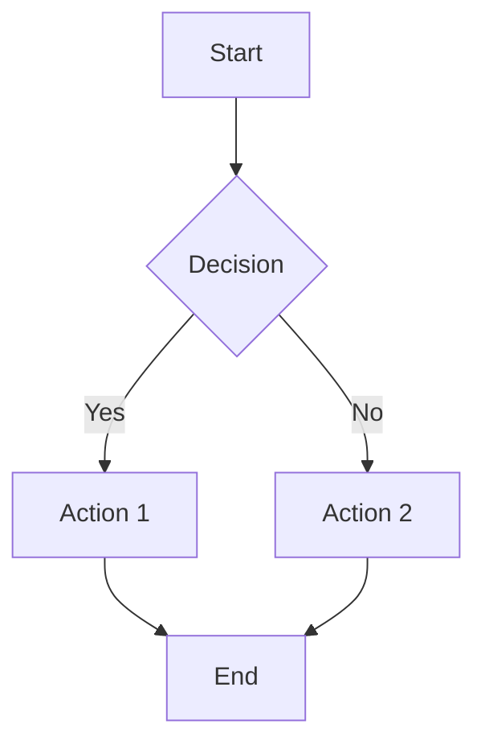
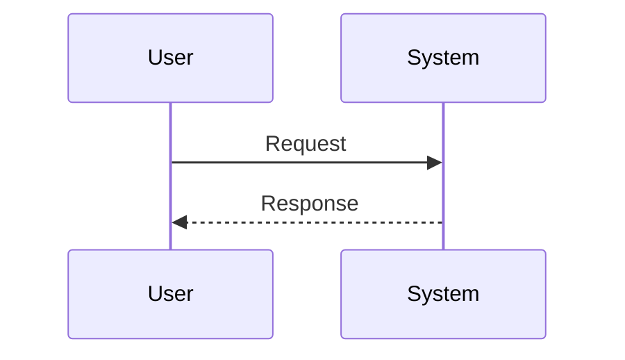

# 1 Markdown Basics

Markdown is a lightweight markup language that you can use to add formatting elements to plaintext text documents.

## 1.1 Headings

Headings are created using the hash symbol (`#`). The number of hashes indicates the heading level.

| Markdown | Rendered Output |
|----------|-----------------|
| `# Heading 1` | <h1>Heading 1</h1> |
| `## Heading 2` | <h2>Heading 2</h2> |
| `### Heading 3` | <h3>Heading 3</h3> |
| `#### Heading 4` | <h4>Heading 4</h4> |
| `##### Heading 5` | <h5>Heading 5</h5> |
| `###### Heading 6` | <h6>Heading 6</h6> |

**Example:**
```markdown
# Main Title
## Section Title
### Subsection Title
```

> **Note:** Always add a space after the hash symbols for proper rendering.

## 1.2 Paragraphs and Line Breaks

### 1.2.1 Paragraphs

Paragraphs are created by separating text with blank lines.

**Example:**
```markdown
This is the first paragraph.

This is the second paragraph.
```

### 1.2.2 Line Breaks

Line breaks can be created in two ways:

| Method | Syntax | Use Case |
|--------|--------|----------|
| **Trailing spaces** | Two spaces at end of line | Manual line break |
| **HTML tag** | `<br>` | Explicit line break |

**Example:**
```markdown
This is line one.  
This is line two.
```

## 1.3 Text Formatting

### 1.3.1 Emphasis

| Style | Syntax | Example | Output |
|-------|--------|---------|--------|
| **Bold** | `**text**` or `__text__` | `**bold**` | **bold** |
| *Italic* | `*text*` or `_text_` | `*italic*` | *italic* |
| ***Bold+Italic*** | `***text***` | `***both***` | ***both*** |
| ~~Strikethrough~~ | `~~text~~` | `~~deleted~~` | ~~deleted~~ |

### 1.3.2 Code Formatting

**Inline code:** Use backticks `` ` ``
```markdown
Use `printf()` to display output.
```

**Code blocks:** Use triple backticks ` ``` `
<pre>
```cpp
int main() {
    return 0;
}
```
</pre>

> **Tip:** Specify the language after the opening backticks for syntax highlighting.

## 1.4 Lists

### 1.4.1 Unordered Lists

Use `-`, `*`, or `+` followed by a space.

**Example:**
```markdown
- First item
- Second item
  - Nested item
  - Another nested item
- Third item
```

### 1.4.2 Ordered Lists

Use numbers followed by a period.

**Example:**
```markdown
1. First step
2. Second step
   1. Sub-step A
   2. Sub-step B
3. Third step
```

> **Note:** The actual numbers don't matter—Markdown will renumber automatically.

### 1.4.3 Task Lists

Create checkable task lists with `[ ]` and `[x]`.

**Example:**
```markdown
- [x] Completed task
- [ ] Incomplete task
- [ ] Another incomplete task
```

## 1.5 Links and Images

### 1.5.1 Links

| Type | Syntax | Example |
|------|--------|---------|
| **Inline** | `[text](url)` | `[Google](https://google.com)` |
| **With title** | `[text](url "title")` | `[Google](https://google.com "Search")` |
| **Reference** | `[text][label]` | `[Google][1]` |

**Reference example:**
```markdown
[Google][1] and [GitHub][2]

[1]: https://google.com
[2]: https://github.com
```

### 1.5.2 Images

Similar to links but with an exclamation mark prefix.

| Type | Syntax | Example |
|------|--------|---------|
| **Inline** | `` | `` |
| **With title** | `` | `` |

**Example:**
```markdown

```

## 1.6 Blockquotes

Use `>` to create blockquotes.

**Example:**
```markdown
> This is a blockquote.
> It can span multiple lines.
>
> > This is a nested blockquote.
```

**Output:**
> This is a blockquote.
> It can span multiple lines.
>
> > This is a nested blockquote.

## 1.7 Horizontal Rules

Create horizontal lines using three or more dashes, asterisks, or underscores.

**Example:**
```markdown
---

***

___
```

## 1.8 Tables

Use pipes `|` and dashes `-` to create tables.

**Example:**
```markdown
| Header 1 | Header 2 | Header 3 |
|----------|----------|----------|
| Cell 1   | Cell 2   | Cell 3   |
| Cell 4   | Cell 5   | Cell 6   |
```

**Alignment:**
```markdown
| Left | Center | Right |
|:-----|:------:|------:|
| A    | B      | C     |
```

> **Tip:** Use colons in the separator line to control alignment (`:---` left, `:---:` center, `---:` right).

## 1.9 Escape Characters

Use backslash `\` to escape special characters.

| Character | Name |
|-----------|------|
| `\*` | Asterisk |
| `\#` | Hash |
| `\[\]` | Brackets |
| `\`\`` | Backtick |
| `\|` | Pipe |
| `\\` | Backslash |

**Example:**
```markdown
\*This is not italic\*
\`This is not code\`
```

---

# 2 Extended Markdown Features

## 2.1 Footnotes

Add footnotes using `[^label]` syntax.

**Example:**
```markdown
This is a statement with a footnote.[^1]

[^1]: This is the footnote content.
```

## 2.2 Definition Lists

Some Markdown processors support definition lists.

**Example:**
```markdown
Term
: Definition of the term

Another Term
: Another definition
```

## 2.3 Emoji

Use emoji shortcodes or Unicode characters.

**Example:**
```markdown
:smile: :heart: :thumbsup:
```

Output: 😄 ❤️ 👍

## 2.4 HTML Inline

Markdown allows you to use raw HTML tags for advanced formatting.

| HTML Tag | Purpose | Example |
|----------|---------|---------|
| `<br>` | Line break | `Line 1<br>Line 2` |
| `<center>` | Center alignment | `<center>Centered text</center>` |
| `<u>` | Underline | `<u>Underlined text</u>` |
| `<sub>` | Subscript | `H<sub>2</sub>O` → H₂O |
| `<sup>` | Superscript | `x<sup>2</sup>` → x² |
| `<mark>` | Highlight | `<mark>Highlighted</mark>` |

**Example:**
```markdown
This is <u>underlined</u> and this is <mark>highlighted</mark>.

Chemical formula: H<sub>2</sub>O
Math exponent: x<sup>2</sup> + y<sup>2</sup> = z<sup>2</sup>
```

## 2.5 Collapsible Sections

Use HTML `<details>` and `<summary>` tags to create collapsible content.

**Example:**
```markdown
<details>
<summary>Click to expand</summary>

This content is hidden by default.
- Item 1
- Item 2
- Item 3

</details>
```

**Output:**
<details>
<summary>Click to expand</summary>

This content is hidden by default.
- Item 1
- Item 2
- Item 3

</details>

## 2.6 Mathematical Expressions

Many platforms support LaTeX math expressions.

| Syntax | Type | Example |
|--------|------|---------|
| `$...$` | Inline math | `$E = mc^2$` |
| `$$...$$` | Block math | `$$\sum_{i=1}^n i = \frac{n(n+1)}{2}$$` |

**Inline example:**
```markdown
The quadratic formula is $x = \frac{-b \pm \sqrt{b^2 - 4ac}}{2a}$.
```

**Block example:**
```markdown
$$
\int_{-\infty}^{\infty} e^{-x^2} dx = \sqrt{\pi}
$$
```

> **Note:** Math support varies by platform (GitHub, Jupyter, Typora support it; standard Markdown does not).

## 2.7 Diagrams (Mermaid)

Some platforms support Mermaid syntax for diagrams.

**Flowchart example:**
<pre>

</pre>

**Sequence diagram example:**
<pre>

</pre>

> **Note:** Mermaid requires platform support (GitHub, Notion, Typora, etc.).

## 2.8 YAML Front Matter

Add metadata at the beginning of the document using YAML format.

**Example:**
```markdown
---
title: My Document
author: John Doe
date: 2024-01-15
tags: [markdown, tutorial]
---

# Document Content

Starts here...
```

> **Use case:** Common in static site generators (Jekyll, Hugo) and note-taking apps (Obsidian).

## 2.9 Automatic Table of Contents

Some platforms automatically generate TOC from headings.

| Platform | Syntax | Description |
|----------|--------|-------------|
| **GitHub** | Automatic | Click the list icon next to the filename |
| **Typora** | `[TOC]` | Inserts table of contents |
| **VS Code** | Extension | Use Markdown All in One extension |

**Manual anchor links:**
```markdown
# Table of Contents
- [Section 1](#section-1)
- [Section 2](#section-2)

## Section 1
Content here...

## Section 2
Content here...
```

## 2.10 Text Highlighting (Extended)

Some platforms support highlight syntax using `==`.

| Syntax | Output | Support |
|--------|--------|---------|
| `==highlighted==` | ==highlighted== | Limited (Obsidian, Typora) |
| `<mark>text</mark>` | <mark>text</mark> | Universal (HTML) |

**Recommendation:** Use `<mark>` for better compatibility.

## 2.11 Comments

Add invisible comments in Markdown.

| Syntax | Usage |
|--------|-------|
| `<!-- comment -->` | HTML comment (standard) |
| `[//]: # (comment)` | Link reference comment |

**Example:**
```markdown
<!-- This is a comment, not visible in rendered output -->

Visible text here.

[//]: # (This is another type of comment)
```

---

# 3 Best Practices

## 3.1 Document Structure

1. **Start with H1**: Each document should have exactly one `# Title`
2. **Hierarchy**: Don't skip levels (don't go from `##` to `####`)
3. **Spacing**: Add blank lines before and after headings

## 3.2 Readability

- Use **bold** for emphasis, not ALL CAPS
- Use `code` for file names, commands, and code
- Use > blockquotes for important notes or quotes
- Keep lines under 80 characters when possible

## 3.3 Compatibility

| Feature | Standard Markdown | GitHub Flavored | CommonMark |
|---------|-------------------|-----------------|------------|
| Tables | ❌ | ✅ | ❌ |
| Task lists | ❌ | ✅ | ❌ |
| Footnotes | ❌ | ❌ | ❌ |
| Strikethrough | ❌ | ✅ | ❌ |

> **Note:** Not all Markdown features work everywhere. Check your platform's documentation.
